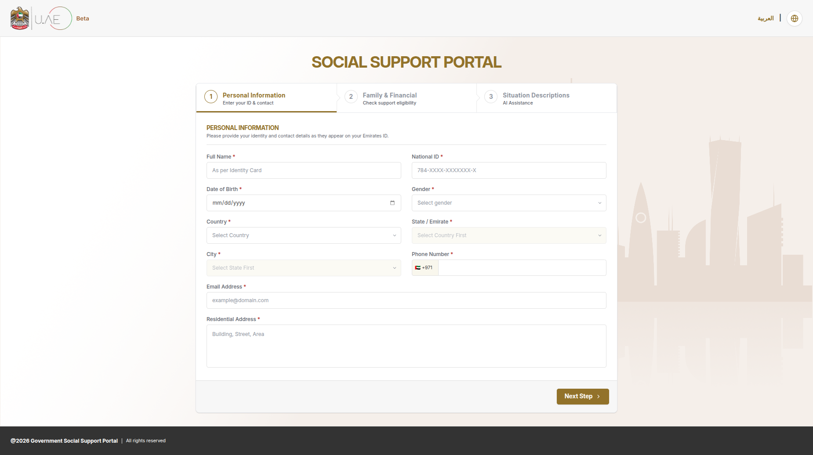
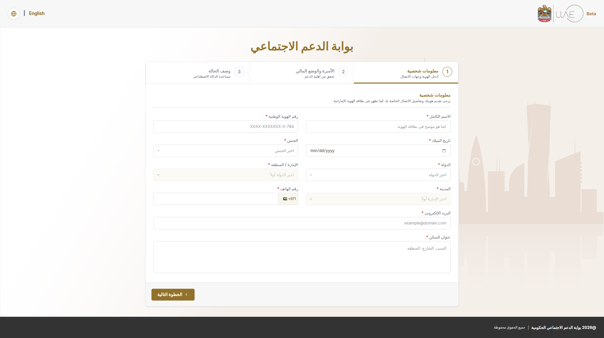
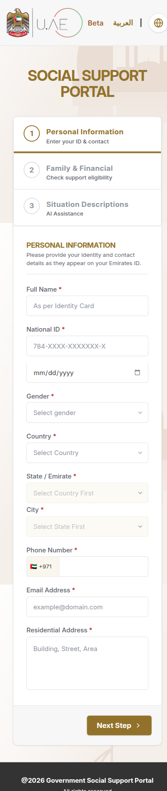
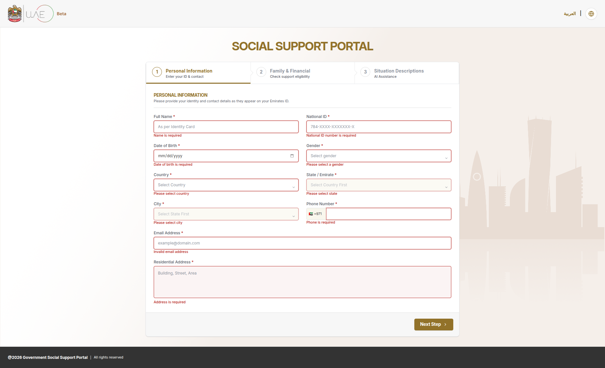
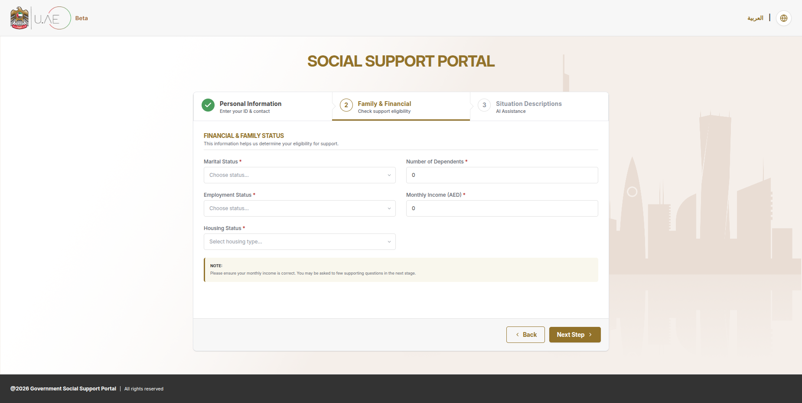
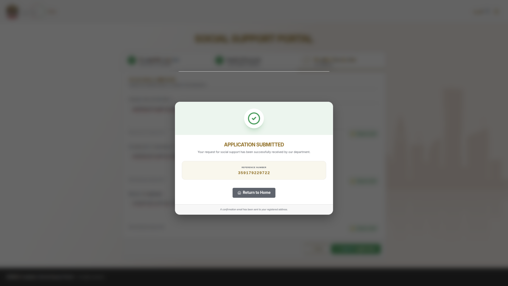

---
## 📸 App Showcase

### 🌍 Desktop Experience (i18n & RTL)
| English (LTR) | Arabic (RTL) |
| :---: | :---: |
|  |  |

### 📱 Responsive & Logic
| Mobile View | Validation & States | Stepper UI |
| :---: | :---: | :---: |
|  |  |  |

### 🤖 Smart Features & Success
| AI "Help Me Write" Modal | Submission Success |
| :---: | :---: |
|  |  |
# 🚀 Social Support Wizard (AI-Powered)

---

This is a multi-step wizard application built with **React** + **Vite**, **TypeScript**, and **Tailwind CSS**. It features full internationalization (English/Arabic), RTL layout support, and an AI assistant to help users draft their situation descriptions.

---

## 🛠️ Getting Started

To get the project running on your local machine, follow these simple steps:

### 1. Installation

First, unwrap the project folder and install the dependencies:

```bash
npm install

```

### 2. Available Scripts

We've set up a few scripts to help you manage the project:

* **`npm run dev`**: Starts the local development server.
* **`npm run build`**: Runs the TypeScript compiler and builds the production-ready app.
* **`npm run test`**: Runs the Vitest suite to check the logic and components.
* **`npm run lint`**: Checks the code for any styling or syntax issues.

### 3. Launching the App

Once you run the dev script, open your browser and go to:

> **[http://localhost:5173](https://www.google.com/search?q=http://localhost:5173)**

---

## 🤖 Setting up the AI Assistant (OpenAI)

The "Help Me Write" feature uses OpenAI to generate text based on user input. You have two ways to test this:

### Option A: Using your own API Key (Recommended)

1. Create a `.env` file in the root directory.
2. Add your key: `VITE_OPENAI_API_KEY=your_key_here`.

### Option B: Using the Mock API (No Key Required)

If you don't have an API key handy, you can switch to our mock environment to see how the UI handles the response:

1. Open the file `src/api/api.https.ts`.
2. **Comment out** the OpenAI URL and the Authorization header.
3. **Uncomment** the mock URL: `https://openai-mock.mock.beeceptor.com`.

---

## 🏗️ Key Features

* **Bilingual UI**: Seamlessly switch between English and Arabic with full RTL (Right-to-Left) support.
* **Smart Persistence**: Your progress is saved in `localStorage`, so refreshing the page won't lose your data.
* **Accessibility**: Fully navigable via keyboard (Tab/Enter) with proper ARIA attributes for screen readers.
* **Fluid Animations**: Direction-aware transitions that flip automatically when switching to Arabic.

---

## 🧪 Running Tests

We've included unit tests for the core logic (Validation, Persistence, and Navigation). To run them:

```bash
npm run test

```

---